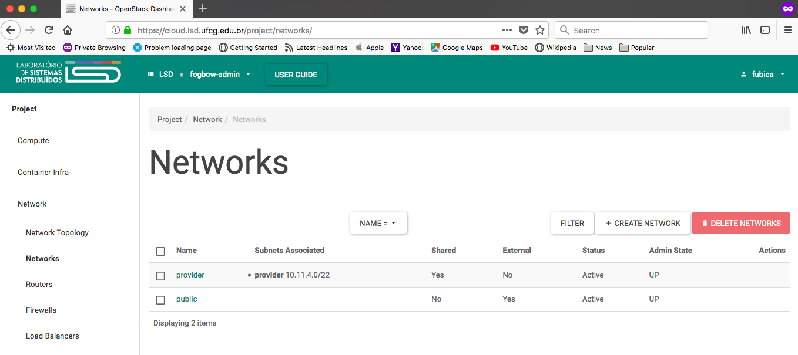
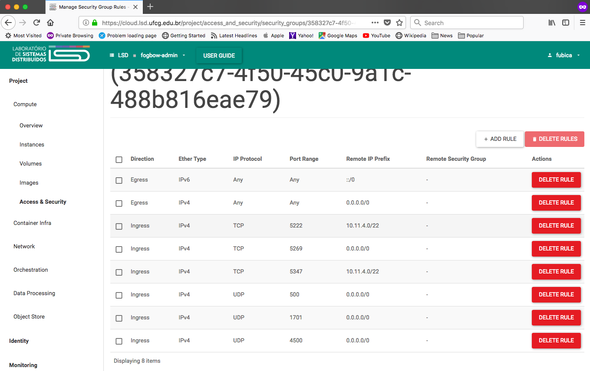
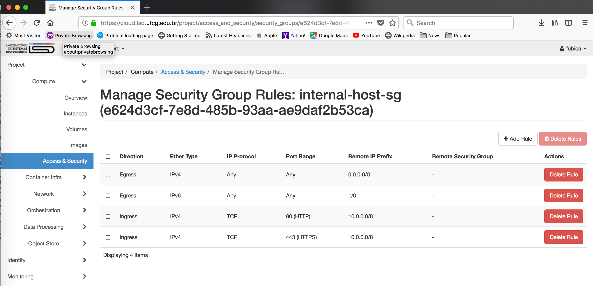
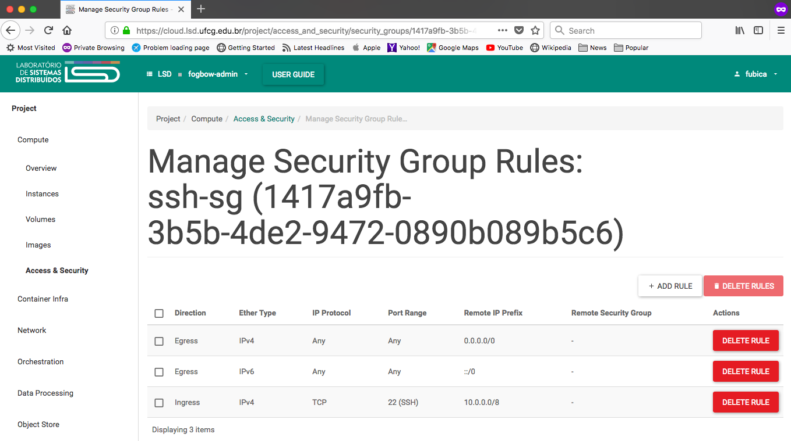

# Creation of deployment machines on an Openstack cloud

First, ask the cloud administrator to create a project, and associate your user to this project.
Let us assume that the project is called **fogbow-admin**. The **fogbow-admin** project must have
access to two networks, a private *tenant network* (Shared=Yes, External Network=No), and a public
*external network* (Shared=No, External Network=Yes). Let us assume that the *tenant network* is
called **provider**, while the *external network* is called **public**.

The resource quota for the **fogbow-admin** project should allow the creation of at least 
two instances. The total vCPU capacity should be at least 3, while the total memory capacity,
should be at least 6Gbytes. One of the instances must have a public IP, or the ability to be
assigned a floating public IP. It should also allow the creation of at least three Security
Groups.

## Create the infrastructure

A typical deployment of a Fogbow site involves the installation of several services. The **messaging-service**
and part of the **federated-network-service** (the **Strong Swan** agent) are deployed in a VM outside the 
private network of the organization, *i.e.* in a DMZ. Let us call this VM the **dmz-host**. The **dmz-host** must 
have a public IP.
 
All remaining services can be deployed in VM instances inside the private network. We assume that a 
single VM will be used, and call it **internal-host**. The following services will be deployed in this VM:
**resource-allocation-service** (RAS), **membership-service** (MS), **federated-network-service** (FNS),
and the **fogbow-gui**. We assume that the **fogbow-gui**, which provides a graphical user interface to Fogbow
users, will be used only from inside the organization's private network. Users needing to use the **fogbow-gui**
from outside the organization will first need to setup a VPN, and then access the service through the VPN.

Before creating the above mentioned VM instances, it is necessary to create appropriate Security Groups that will
be assigned to them.

Log in in the cloud dashboard (Horizon) using your credentials and select the **fogbow-admin** project. 

Firstly, access the "Project/Networks/Network" menu (see Figure below).

You should see at least the **provider**  and the **public** networks displayed. You need to take note of 
the network IDs of both networks, and the CIDR of the **provider** network (**10.11.4.0/22**
in the example shown in the Figure). The network IDs can be seen by clicking on the network name,
and then on the "Overview" tab (see Figure below; in this example the ID of the **provider** network
is **64ee4355-4d7f-4170-80b4-5e8348af6a61**). Let us assume that the ID of the **public** network is
**9cdf8226-fd6c-499a-994e-d12e51a498af**.

Then, access the "Project/Compute/Access & Security" menu, and create three new Security Groups, one for the
**dmz-host**, another for the **internal-host**, and a temporary one, to allow ssh access to both hosts,
during service installation. You do that by clicking on the "+ CREATE SECURITY GROUP"
button, and using the values described below.
 
### Security group for the **dmz-host**

* Name: **dmz-host-sg**
* Description: **Allows traffic to the world, and from the world to the XMPP server and the Strong Swan agent.**

After the security group is created, you need to add its rules. Click on the "MANAGE RULES" button, 
and then multiple times on the "+ADD RULE" button to add the following rules:

* **Custom TCP Rule, Ingress, Port, 5222, CIDR: provider CIDR (eg. 10.11.4.0/22).**
* **Custom TCP Rule, Ingress, Port, 5347, CIDR: provider CIDR (eg. 10.11.4.0/22).**
* **Custom TCP Rule, Ingress, Port, 5269, CIDR: 0.0.0.0/0.**
* **Custom UDP Rule, Ingress, Port, 500, CIDR: 0.0.0.0/0.**
* **Custom UDP Rule, Ingress, Port, 1701, CIDR: 0.0.0.0/0.**
* **Custom UDP Rule, Ingress, Port, 4500, CIDR: 0.0.0.0/0.**

After that, the **dmz-host-sg** Security Group should look like what is shown in the Figure below.

Ports 5222, 5347 and 5269 are used by the XMPP **messaging-service**, while ports 500, 1701 and 4500 are 
used by the **Strong Swan** agent that is part of the **federated-network-service**.

### Security group for the **internal-host**

* Name: **internal-host-sg**
* Description: **Allows traffic from the organization's private network to the RAS API of the services running in
the internal-host.**

Again, click on the "MANAGE RULES" button, and on the "+ADD RULE" button to add the following rule:

* **Custom TCP Rule, Ingress, Port, 80, CIDR: organization's private network CIDR (eg. 10.0.0.0/8).**
* **Custom TCP Rule, Ingress, Port, 443, CIDR: organization's private network CIDR (eg. 10.0.0.0/8).**

After that, the **internal-host-sg** Security Group should look like what is shown in the Figure below.

### Security group for temporary ssh access

* Name: **ssh-sg**
* Description: **Allows traffic from the organization's private network to the ssh port (22).**

Again, click on the "MANAGE RULES" button, and on the "+ADD RULE" button to add the following rule:

* **Custom TCP Rule, Ingress, Port, 22, CIDR: organization's private network CIDR (eg. 10.0.0.0/8).**

After that, the **ssh-sg** Security Group should look like what is shown in the Figure below.

### Create **dmz-host**

Now you can create the **dmz-host** VM. Go to the "Project/Compute/Instances" menu and click on the 
"LAUNCH INSTANCE" button. Follow the step-by-step procedure to select an appropriate image, and flavor.
The instance must have at least 1 vCPU and 2 Gbytes of RAM. Make sure you will include the **provider**
network, and the **dmz-host-sg** and **ssh-sg** Security Groups. The **dmz-host** will be created and
will receive a private IP from the **provider** network. Take note of this private IP. Let us assume
that it is **10.11.4.2**.

Then, you need to associate a floating IP to the newly created **dmz-host** VM. You can do that by
clicking on the "ASSOCIATE FLOATING IP" button that appears next to the VM in the "Project/Compute/Instances"
screen. Take note of this public IP. Let us assume that the floating IP assigned is **100.30.1.1**.

### Create **internal-host**

Follow similar steps as described above to create the **internal-host** VM. Again, follow the step-by-step procedure
to select an appropriate image, and flavor. The **internal-host** must have at least 2 vCPUs and 4 Gbytes of RAM.
This time, make sure you will include the **provider** network, and both the **internal-host-sg** and the **ssh-sg**
Security Groups. The **internal-host** will be created and will receive a private IP from the **provider** network. 
Take note of this private IP. Let us assume that it is **10.11.4.3**.

*Note: After installation, the **ssh-sg** security group can be removed from both instances by clicking
on the "Edit Security Groups" button, and then selecting remove (-).
